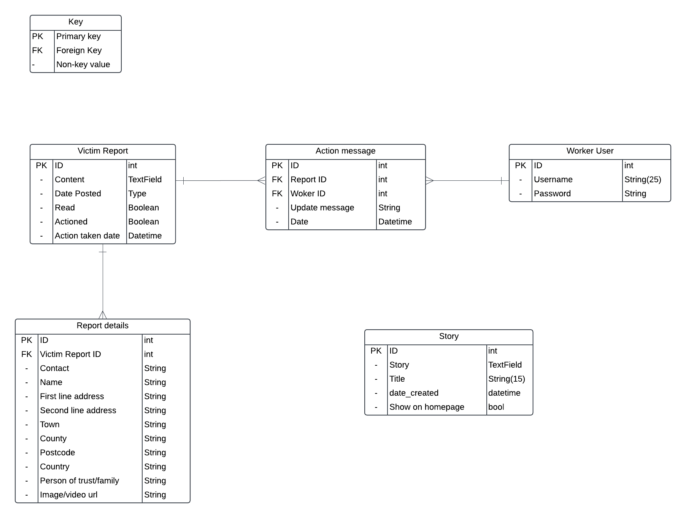
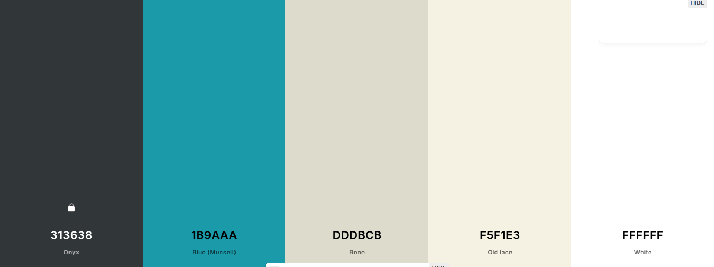

# Project Name - 

here we neeed to add a description 
* [Link to Deployed Project](https://(url for project).herokuapp.com/)

## CONTENTS
* [USER EXPERIENCE (UX)](#user-experience)
  * [Purpose & target audience](#purpose-and-target-audience)
  * [Goals](#goals)
  * [E-commerce business model](#e-commerce-business-model-documentation)
  * [Marketing strategy](#marketing-strategy)
* [PROJECT DESIGN](#project-design)
  * [Wireframes](#wireframes)
  * [User Stories](#user-stories)
  * [Logic](#logic)
  * [Color Scheme](#color-scheme)
  * [Imagery](#imagery)
  * [Typography](#typography)
  * [MVP](#mvp-minimun-vialble-product)
* [FEATURES](#features)
* [VALIDATION](#validation)
* [TECH STACK](#tech-stack)
  * [Languages and Frameworks](#languages-and-frameworks)
  * [Tools and Libraries](#tools-and-libraries)
* [TESTING](#testing)
  * [Tests performed](#tests-performed)
  * [User Story Tests](#user-story-tests)
  * [Bugs resolved](#bugs-resolved)
  * [Unresolved bugs](#unresolved-bugs)
  * [Improvements & future developments](#improvements-and-future-developments)
* [DEPLOYMENT](#deployment)
* [FORKING & CLONING INSTRUCTIONS](#forking-and-cloning-instructions)
* [SECURITY SETTINGS](#security-settings)
* [CREDITS](#credits)
  * [Resources](#resources)
  * [Content](#content)
  * [Media](#media)
  

## PROJECT DESIGN

  ### Wireframes

   The initial wireframes were created in [Miro](https://miro.com/es/) to understand how the site would work, and this layout would drive User Stories, the logic required and overall design artwork decisions.

  
Desktop

  

   
    
Mobile

  

    

  ### Logic
  The database schema and website logic was conceived and created using [Lucid](https://lucid.app/) as follows:

  Database Structure:

* [Back to Contents](#contents)

  ### Color Scheme
  The main colours of orange, dark blue and white were chosen for maximum contrast. I used [Coolors](https://coolors.co) to generate a colour palette.

  I used [Canva](https://www.canva.com/) to generate a logo and a style guide.

    

  * [Back to Contents](#contents)

  ### Imagery
  - I used FontAwesome https://fontawesome.com/ for various icons in the navbar, shopping bag, and other places for visual effects.

    

  - I used [Pexels](https://www.pexels.com/es-es/) for free images .

  * [Back to Contents](#contents)

  ### Typography
   * I used a default Google font of Roboto and sans serif throughout the website for visual clarity and consistency.
   * And  Alfa+Slab+One&display font for the title of the home page 
   

## TECH STACK
The site has been built with the following tech, tools and libraries

### Languages and Frameworks

* HTML5
* CSS
* JavaScript
* Python
* Jquery
* Django - web framework
* Django AllAuth - user authentication
* Psycopg2 - postgreSQL adapter for python
* ElephantSQL - database hosting
* Cloudinary - media hosting
* Pillow - python image processing library
* Gunicorn - WSGI HTTP server for UNIX
* Bootstrap 5 and react-bootsrap - frontend responsive styling framework
* Fontawesom icons
* Heroku - live site hosting

### Tools and Libraries
* GitHub Projects - agile management, kanban, roadmap and milestones
* GitHub Repo - code storage
* Git - version control
* GitPod & VS Code - IDE
* [Miro](https://balsamiq.com/) - creating wireframes
* [Coolors](https://coolors.co) - color pallette generator
* [Image resizer](https://www.reduceimages.com/) - resizing images for optimal storage
* [Canva](https://www.canva.com/) - creating artwork
* Google Fonts - consistent typography
* [Lucid Chart](https://lucid.app/) - creating a database schema
* [FontAwesome](https://fontawesome.com/) - icons
* [W3C HTML Validator](https://validator.w3.org/) - html code validation
* [W3C CSS Jigsaw Validator](https://jigsaw.w3.org/css-validator/) - css code validation
* LightHouse - measures performance, accessibility, best practices and SEO
* Chrome Dev Tools - for development debugging
* [CI Python Linter](https://pep8ci.herokuapp.com/) - code analysis tool conforming to pep8
* Prettier - code formatter for html, css and javascript
* ESLint - code analysis tool for javascript

## DEPLOYMENT
  for a deployment, keep in mind that depending on the functionalities, some extra configuration may be missing. Very important is the configuration of variables in Heroku and the add-ons since without these activated you will not be able to see the project correctly

  Initially, Django was installed following this Code Institute [DRF Cheatsheet](https://docs.google.com/document/d/1LCLxWhmW_4VTE4GXsnHgmPUwSPKNT4KyMxSH8agbVqU/edit#heading=h.mpopj7v69qqn)

   1. Create a Cloudinary account and gather API key
   2. Create ElephantSQL database and gather API key
   3. Install Django
   4. Create project
   5. Install Cloudinary Storage
   6. Install Pillow (image processing)
   7. Update INSTALLED_APPs
       * all apps in the django project must be make migrations
       * python manage.py makemigrations
       * python manage.py migrate
       * to pass external data to the models if you need it.
          - create the fixture folder
          - add your file.json to the folder
          - python manage.py loaddata 'name.json' 
   8. Create env.py file
       * Add CLOUDINARY_KEY (from Cloudinary API key)
       * Add SECRET_KEY - (a unique password)
       * ADD DATABASE_URL - (postgres ElephantSQL API key)
       * STRIPE_SECRET_KEY 
       * STRIPE_PUBLIC_KEY 
       * DEBUG = True (if you have to push to heroku set False)
   9. Update settings.py
       * CLOUDINARY_STORAGE
       * Define Media Storage URL
       * Set DEFAULT_FILE_STORAGE
       * Set DATABASES
       * set STRIPE settings
    

  ### Deployment to Heroku involved the following steps and changes:
   1. Set up DEBUG in settins.py to False
   2. install gunicorn ==22.0.0
   3. Create a Procfile (web: gunicorn core.wsgi:application) 
   4. Create a runtime.txt file and add the following: Python-3.12.3
   5. Terminate all servers.
       * Ensure DEBUG and DEV in env.py are commented out
       * python3 manage.py runserver
   6. Check project is displaying in the preview on port 8000 or gitpod
   7. Log into your Heroku account, create a new app, and access the dashboard for your application
   8. Go to Settings and open the Config Vars add all the Api keys in your env.py
       * Add CLOUDINARY_KEY (the Cloudinary API key)
       * Add SECRET_KEY - (the unique password)
       * Add DATABASE_URL - (postgres ElephantSQL API key)
       * Add STRIPE_SECRET_KEY - (stripe payments Api key)
   9. Ensure your application has an ALLOWED_HOST your '.herokuapp.com' - '.gitpod.io'
   10. Ensure in Resources in heroku dasboard change your dinos active.
   11. Go to the Deploy tab, connect the project to GitHub, and choose main branch to deploy
       * Click Deploy Branch (manually)
       * (Optional) Select Enable Automatic Deploys

* [Back to Contents](#contents)

## FORKING AND CLONING INSTRUCTIONS
You can create a copy of a GitHub Repository without affecting the original by forking or cloning it.

### Here's a step-by-step guide to forking:
Forking is often used for proposing changes or using the project as a starting point for your own idea. Forking will apear on your GitHub profile.
1. Log into GitHub or sign up for an account.
2. Go to the [Iron Haven Fitness Repository](https://github.com/richard9106/Project-5)
3. Click "Fork" on the right side of the repository's page to create a copy in your own repository.

### Here's a step-by-step guide to cloning:
Cloning is often used for experimenting locally.  It will not show up on your GitHub profile.
1. Go to the [Iron Haven Fitness Repository](https://github.com/richard9106/Project-5)
2. Click the green code button, then the arrow, and select the "clone by https" option to copy the URL.
3. Open your preferred code editor and navigate to the directory where you want to clone the repository.
4. Type 'git clone', paste the copied URL, and press enter. The repository will then be cloned to your machine.

* [Back to Contents](#contents)

 ### Resources
  I used the following resources to help develop features and functionality:
 
  * ChatGPT was used to help troubleshoot and explain code functions
  * Google and StackOverflow were also used for more context and understanding
  * I reached out to Code Institute team members and tutor support from time to time

  * [Back to Contents](#contents)

  ### Media
  * The Iron Haven Fitness logo was custom-designed for this project.
  * Logo icon created in Canva Pro.
  * images from pexel
  * Icons - font awesome.

  * [Back to Contents](#contents)