# Know the signs

"Know the Signs" is a comprehensive platform dedicated to raising awareness about human trafficking and slavery. The website provides users with accurate and up-to-date information on the signs and symptoms of human trafficking, aiming to educate and empower individuals to identify potential victims and take appropriate action. The platform is designed to be user-friendly and accessible to a wide audience, including individuals, law enforcement, social workers, educators, community leaders, and survivors of human trafficking.
Reports are reviewed by trained staff who ensure that proper action is taken.

Stories of inspiration can also be found on the website for victims. 
Additionally, there is a page dedicated on advice to recognise exploitation in others.

Key features of the website include:
- Educational resources on human trafficking and slavery.
- Interactive features suuch as  user stories to encourage engagement.
- Collaboration with law enforcement, social workers, and NGOs to ensure trustworthy content.
- A supportive community where users can share their experiences and support each other.

By providing these resources and fostering a community of support, "Know the Signs" aims to make a significant impact in the fight against human trafficking and slavery.

* [Link to Deployed Project](https://knowthe-signs-e02e6c0640d7.herokuapp.com/)

## CONTENTS
- [Know the signs](#know-the-signs)
  - [CONTENTS](#contents)
  - [USER EXPERIENCE (UX)](#user-experience-ux)
    - [Purpose](#purpose)
    - [Target Audience](#target-audience)
    - [Goals](#goals)
    - [E-commerce Business Model](#e-commerce-business-model)
    - [Marketing Strategy](#marketing-strategy)

  - [PROJECT DESIGN](#project-design)
    - [Wireframes](#wireframes)
    - [Logic](#logic)
    - [Color Scheme](#color-scheme)
    - [Imagery](#imagery)
    - [Typography](#typography)
  - [Tech. stack](#tech-stack)
    - [Languages and frameworks](#languages-and-frameworks)
  - [Hosting platforms](#hosting-platforms)
  - [Packages](#packages)
    - [Tools and Libraries](#tools-and-libraries)
   
  
  
  - [DEPLOYMENT](#deployment)
    - [Deployment to Heroku involved the following steps and changes:](#deployment-to-heroku-involved-the-following-steps-and-changes)
  - [FORKING AND CLONING INSTRUCTIONS](#forking-and-cloning-instructions)
    - [Here's a step-by-step guide to forking:](#heres-a-step-by-step-guide-to-forking)
    - [Here's a step-by-step guide to cloning:](#heres-a-step-by-step-guide-to-cloning)
    - [Resources](#resources)
    - [Media](#media)
 
 - [Testing and Validations](#testing-and-validations)
   * [TESTING](#testing)
    * [Improvements & future developments](#improvements-and-future-developments)
  - [User Stories and Acceptance criteria](#user-stories-and-acceptance-criteria)
  - [Future features](#future-features)

  - [Credits](#credits)
      - [Content References](#content-references)
      - [Copilot](#copilot)
      - [Educational sites](#educational-sites)

  - [Acknowledgement](#acknowledgement)
    - [Images](#images)

## USER EXPERIENCE (UX)

### Purpose

The purpose of "Know the Signs" is to provide users with a comprehensive platform to learn about the signs and symptoms of human trafficking and slavery. The platform aims to educate and raise awareness among users to help them identify potential victims and take appropriate action to prevent and combat human trafficking.

### Target Audience

- Individuals interested in learning about human trafficking and slavery.
- People looking to educate themselves on the signs and symptoms of human trafficking.
- Law enforcement and social workers seeking resources to identify and assist victims.
- Educators and community leaders aiming to raise awareness about human trafficking.
- Victims and survivors of human trafficking looking for support and resources.

### Goals

**Key Project Goals**:
1. **Educational Resource**: Provide accurate and up-to-date information on the signs and symptoms of human trafficking and slavery.
2. **User-Friendly Interface**: Ensure the platform is easy to navigate and accessible to users of all ages and technical abilities.
3. **Engagement**: Encourage user engagement through interactive features such as quizzes, forums, and user stories.
4. **Trustworthy Content**: Collaborate with law enforcement, social workers, and NGOs to ensure the content is reliable and trustworthy.
5. **Community Support**: Build a supportive community where users can share their experiences and support each other.

### E-commerce Business Model

**E-commerce Business Model Documentation**:
1. **Product Offerings**: 
   - Digital health guides and e-books.
   - Subscription-based access to premium content and features.
   - Online courses and webinars on health and wellness topics.

2. **Revenue Streams**:
   - Subscription fees for premium content.
   - Sales of digital products (e-books, guides).
   - Advertising and sponsorships from health-related brands.
   - Affiliate marketing through partnerships with healthcare providers and wellness brands.

3. **Customer Acquisition**:
   - Leverage social media platforms to reach a wider audience.
   - Collaborate with healthcare influencers and professionals to promote the platform.
   - Offer free trials and discounts to attract new users.

4. **Customer Retention**:
   - Provide high-quality, regularly updated content to keep users engaged.
   - Offer personalized recommendations based on user preferences and behavior.
   - Implement a loyalty program to reward long-term subscribers.

### Marketing Strategy

**Marketing Strategy**:
1. **Content Marketing**:
   - Create and share informative blog posts, articles, and videos on human trafficking awareness and prevention.
   - Develop a content calendar to ensure consistent posting and engagement.

2. **Social Media Marketing**:
   - Utilize platforms like Facebook, Instagram, Twitter, and LinkedIn to reach and engage with the target audience.
   - Run targeted ad campaigns to attract new users and promote premium content.

3. **Email Marketing**:
   - Build an email list by offering free resources and incentives for sign-ups.
   - Send regular newsletters with updates, tips, and exclusive offers to keep subscribers engaged.

4. **Search Engine Optimization (SEO)**:
   - Optimize the website and content for search engines to improve visibility and organic traffic.
   - Use relevant keywords, meta tags, and high-quality backlinks to enhance SEO efforts.

5. **Partnerships and Collaborations**:
   - Partner with NGOs, law enforcement agencies, and influencers to promote the platform.
   - Collaborate on webinars, workshops, and events to increase brand awareness and credibility.

6. **Analytics and Feedback**:
   - Use analytics tools to track user behavior, engagement, and conversion rates.
   - Gather feedback from users to continuously improve the platform and address their needs.

By focusing on these key areas, "Know the Signs" aims to create a valuable resource for users while building a sustainable and impactful platform to combat human trafficking and slavery.

## PROJECT DESIGN

  ### Wireframes

   The initial wireframes were created in [Miro](https://miro.com/app/board/uXjVLsxo6qA=/) to understand how the site would work, and this layout would drive User Stories, the logic required and overall design artwork decisions.

  
Desktop

  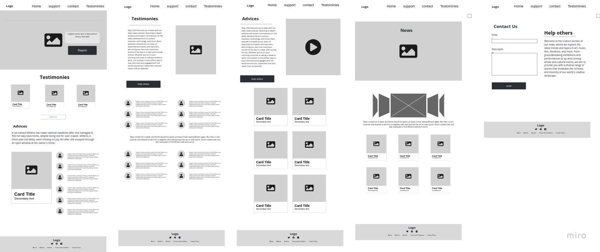

   
    
Mobile

  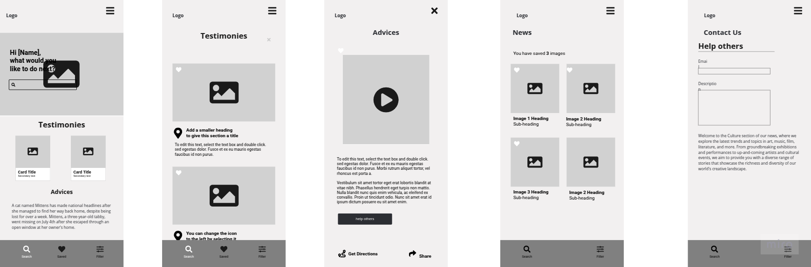

    

  ### Logic
  The database schema and website logic was conceived and created using [Lucid](https://lucid.app/) as follows:

  Database Structure:

* [Back to Contents](#contents)

  ### Color Scheme
  The main colours of orange, dark blue and white were chosen for maximum contrast. I used [Coolors](https://coolors.co) to generate a colour palette.

  I used [Canva](https://www.canva.com/) to generate a logo and a style guide.

    

  * [Back to Contents](#contents)

  ### Imagery
  - I used FontAwesome https://fontawesome.com/ for various icons in the navbar, shopping bag, and other places for visual effects.

    

  - I used [Pexels](https://www.pexels.com/es-es/) for free images .

  * [Back to Contents](#contents)

  ### Typography
   * I used a default Google font of Roboto and sans serif throughout the website for visual clarity and consistency.
   * And  Alfa+Slab+One&display font for the title of the home page 
   

## Tech. stack
The site has been built with the following tech, tools and libraries

### Languages and frameworks

* HTML5
* CSS3
* JavaScript
* JQuery
* Python
* Django
* Pillow - python image processing library
* Bootstrap 5 - frontend responsive styling framework

## Hosting platforms
* AWS - Host SQL database
* Cloudinary - Host images/videos
* Heroku - Host Django website
* Git - Host repository and project booard

## Packages
* Psycopg2 - postgreSQL adapter for python
* Gunicorn - WSGI HTTP server for UNIX
* Django AllAuth - user authentication
* Django crispy forms - Bootstrap form styling 

### Tools and Libraries
* GitHub Projects - agile management, kanban, roadmap and milestones
* GitHub Repo - code storage
* Git - version control
* GitPod & VS Code - IDE
* [Miro](https://balsamiq.com/) - creating wireframes
* [Coolors](https://coolors.co) - color pallette generator
* [Image resizer](https://www.reduceimages.com/) - resizing images for optimal storage
* [Canva](https://www.canva.com/) - creating artwork
* Google Fonts - consistent typography
* [Lucid Chart](https://lucid.app/) - creating a database schema
* [FontAwesome](https://fontawesome.com/) - icons
* [W3C HTML Validator](https://validator.w3.org/) - html code validation
* [W3C CSS Jigsaw Validator](https://jigsaw.w3.org/css-validator/) - css code validation
* LightHouse - measures performance, accessibility, best practices and SEO
* Chrome Dev Tools - for development debugging
* [CI Python Linter](https://pep8ci.herokuapp.com/) - code analysis tool conforming to pep8
* Prettier - code formatter for html, css and javascript
* ESLint - code analysis tool for javascript

## DEPLOYMENT
  for a deployment, keep in mind that depending on the functionalities, some extra configuration may be missing. Very important is the configuration of variables in Heroku and the add-ons since without these activated you will not be able to see the project correctly

  Initially, Django was installed following this Code Institute [DRF Cheatsheet](https://docs.google.com/document/d/1LCLxWhmW_4VTE4GXsnHgmPUwSPKNT4KyMxSH8agbVqU/edit#heading=h.mpopj7v69qqn)

   1. Create a Cloudinary account and gather API key
   2. Create PostgresSQL database and gather API key
   3. Install Django
   4. Create project
   5. Install Cloudinary Storage
   6. Install Pillow (image processing)
   7. Update INSTALLED_APPs
       * all apps in the django project must be make migrations
       * python manage.py makemigrations
       * python manage.py migrate
       * to pass external data to the models if you need it.
          - create the fixture folder
          - add your file.json to the folder
          - python manage.py loaddata 'name.json' 
   8. Create env.py file
       * Add CLOUDINARY_KEY (from Cloudinary API key)
       * Add SECRET_KEY - (a unique password)
       * ADD DATABASE_URL - (postgres ElephantSQL API key)
       * STRIPE_SECRET_KEY 
       * STRIPE_PUBLIC_KEY 
       * DEBUG = True (if you have to push to heroku set False)
   9. Update settings.py
       * CLOUDINARY_STORAGE
       * Define Media Storage URL
       * Set DEFAULT_FILE_STORAGE
       * Set DATABASES
       * set STRIPE settings
    

  ### Deployment to Heroku involved the following steps and changes:
   1. Install gunicorn and psycopg2 then freeze requirements to requirements.txt.
   2. Create a Procfile (web: gunicorn core.wsgi:application).
   3. Log into your Heroku account, create a new app, and access the dashboard for your application.
   4. Go to Settings and open the Config Vars add all the Api keys in your env.py
       * Add CLOUDINARY_KEY (the Cloudinary API key)
       * Add SECRET_KEY - (the unique password)
       * Add STRIPE_SECRET_KEY - (stripe payments Api key)
       * AWS_DB_NAME - AWS database name
       * AWS_HOST - AWS url
       * AWS_PASSWORD
       * AWS_USER
       * DEVELOPMENT - Set to "False", to use AWS instead of local database
       * SECRET_KEY - Contains your Django secret key for encryption
       * ALLOWED_HOST - Ensure you add the url here. This will allow your application to run on the domain.
   6.  Ensure in Resources in heroku dasboard change your dinos active.
   7.  Go to the Deploy tab, connect the project to GitHub, and choose main branch to deploy
       * Click Deploy Branch (manually)
       * (Optional) Select Enable Automatic Deploys

* [Back to Contents](#contents)

## FORKING AND CLONING INSTRUCTIONS
You can create a copy of a GitHub Repository without affecting the original by forking or cloning it.

### Here's a step-by-step guide to forking:
Forking is often used for proposing changes or using the project as a starting point for your own idea. Forking will apear on your GitHub profile.
1. Log into GitHub or sign up for an account.
2. Go to the [Know the Sign Repository](https://github.com/AnishAzharudeen/knowthesigns)
3. Click "Fork" on the right side of the repository's page to create a copy in your own repository.

### Here's a step-by-step guide to cloning:
Cloning is often used for experimenting locally.  It will not show up on your GitHub profile.
1. Go to the [Know the Sign Repository](https://github.com/AnishAzharudeen/knowthesigns)
2. Click the green code button, then the arrow, and select the "clone by https" option to copy the URL.
3. Open your preferred code editor and navigate to the directory where you want to clone the repository.
4. Type 'git clone', paste the copied URL, and press enter. The repository will then be cloned to your machine.

* [Back to Contents](#contents)

 ### Resources
  I used the following resources to help develop features and functionality:
 
  * ChatGPT was used to help troubleshoot and explain code functions
  * Google and StackOverflow were also used for more context and understanding
  * I reached out to Code Institute team members and tutor support from time to time

  * [Back to Contents](#contents)

  ### Media
  * The Iron Haven Fitness logo was custom-designed for this project.
  * Logo icon created in Canva Pro.
  * images from pexel
  * Icons - font awesome.

  * [Back to Contents](#contents)

## User Stories and Accepatance Criteria

### User Stories for Users
* 1.As a User, I want to learn about the signs of human trafficking, so that I can identify potential victims.
* 2.As a User, I want to access educational resources, so that I can educate myself on human trafficking and slavery.
* 3.As a User, I want to participate in interactive quizzes, so that I can test my knowledge on human trafficking.
* 4.As a User, I want to read and share user stories, so that I can learn from others' experiences and share my own.
* 5.As a User, I want to join forums, so that I can discuss and engage with the community on topics related to human trafficking.
* 6.As a User, I want to access support resources, so that I can find help if I or someone I know is a victim of human trafficking.
* 7.As a User, I want to receive regular updates and newsletters, so that I can stay informed about new information and resources.
* 8.As a User, I want to have a user-friendly interface, so that I can easily navigate the website and find the information I need.

### User Stories for Admins
* 1.As an Admin, I want to manage user accounts, so that I can ensure the security and integrity of the platform.
* 2.As an Admin, I want to add and update educational content, so that the information provided is accurate and up-to-date.
* 3.As an Admin, I want to moderate forums and user stories, so that I can maintain a safe and respectful community environment.
* 4.As an Admin, I want to manage interactive quizzes, so that I can provide engaging and informative content for users.
* 5.As an Admin, I want to collaborate with law enforcement and NGOs, so that I can ensure the content is trustworthy and reliable.
* 6.As an Admin, I want to track user engagement and feedback, so that I can continuously improve the platform.
* 7.As an Admin, I want to manage support resources, so that users can easily find help and assistance.
* 8.As an Admin, I want to implement and manage marketing strategies, so that I can attract and retain users.

## Future features

We have several exciting features planned for future development to enhance this website

- **Feedback to improve**: Implement a system where reporters receive regular feedback on their issue's progress. This will help reports  stay informed.

These future features aim to create a more comprehensive and interactive learning environment, supporting the educational growth of children while keeping parents and teachers actively involved.

## Testing and Validations

### Testing
* Validation of HTML/CSS/JavaScript, Lighthouse Audits, Bugs
 #### Google Lighthouse Testing:

 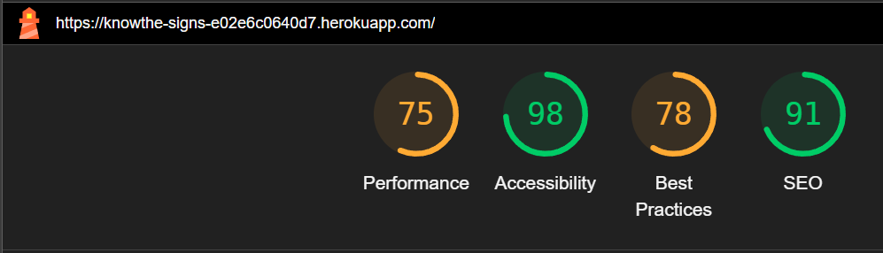
 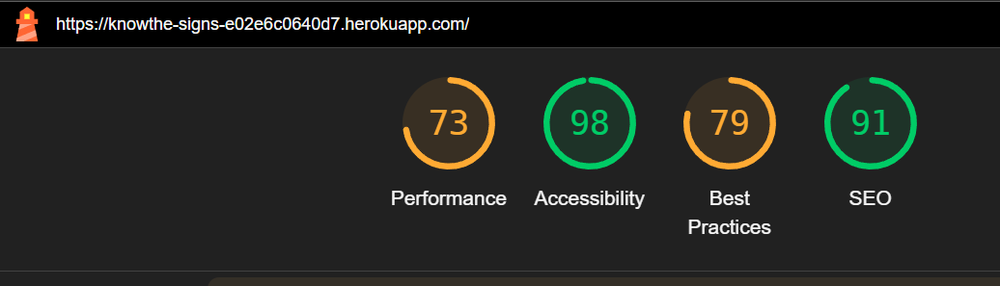
 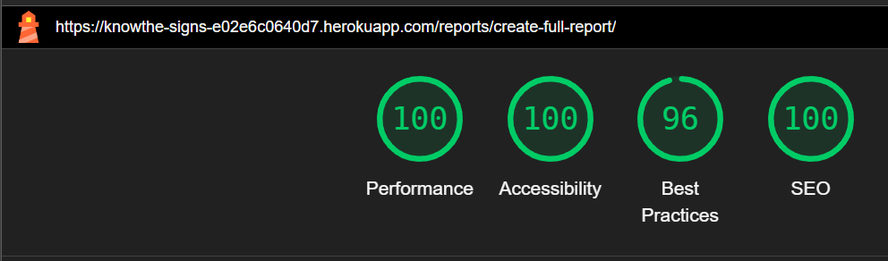
 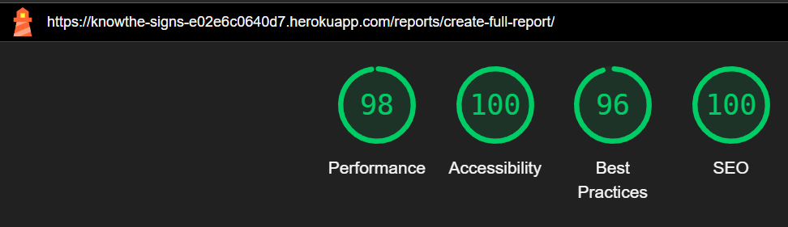
 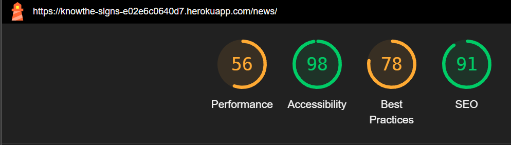
 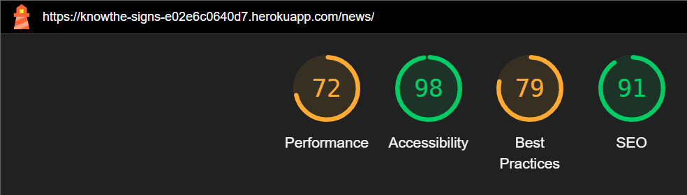
 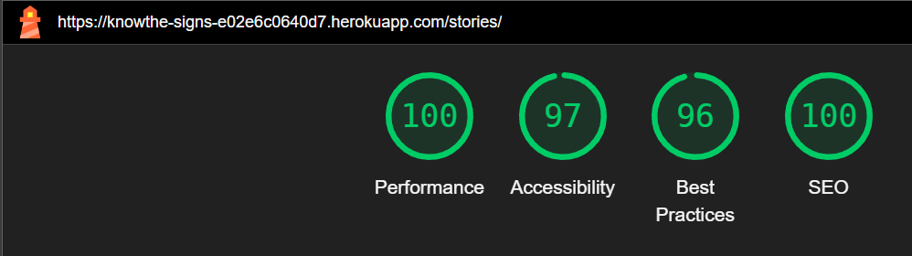
 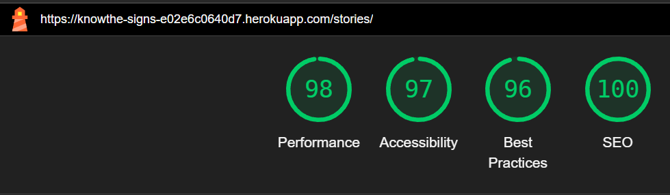

 ####  Css Validation:
  
  Passed CSS validation for all the three css files

 ![CSSResults][cssValidationImage]

 ####  HTML Validation:

 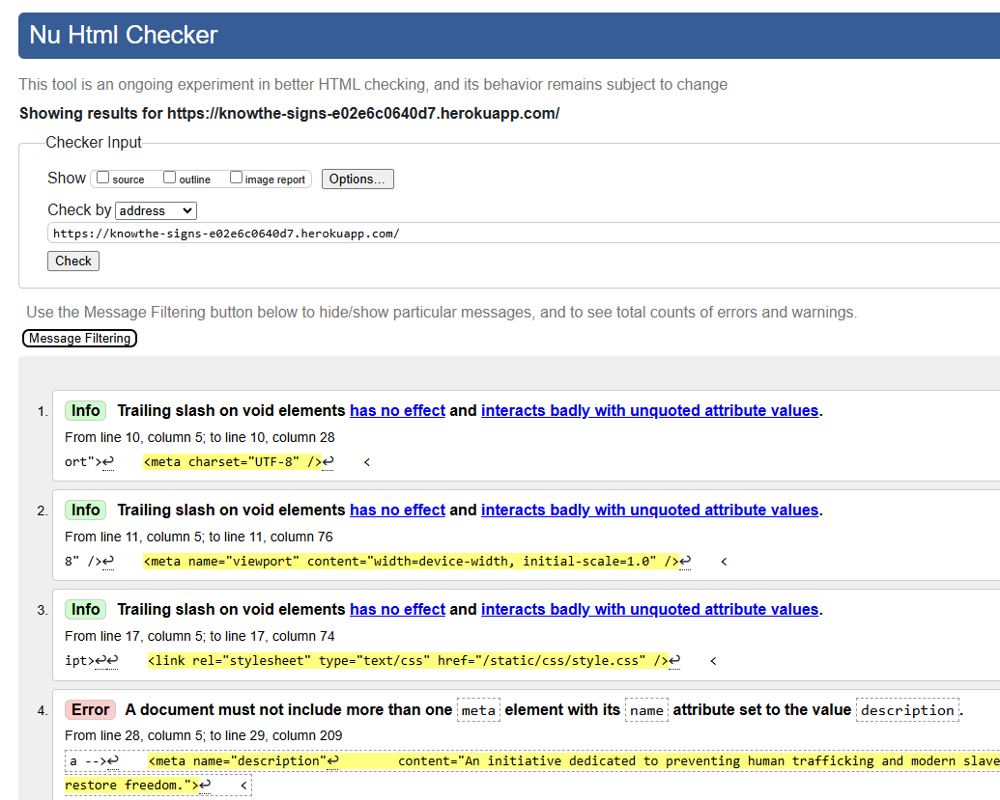
 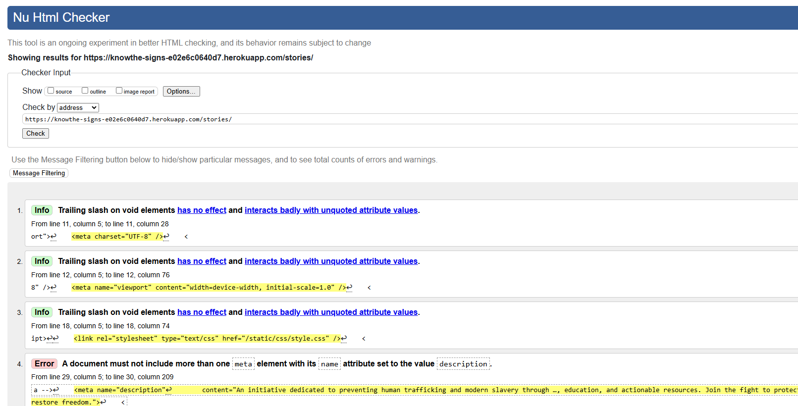
 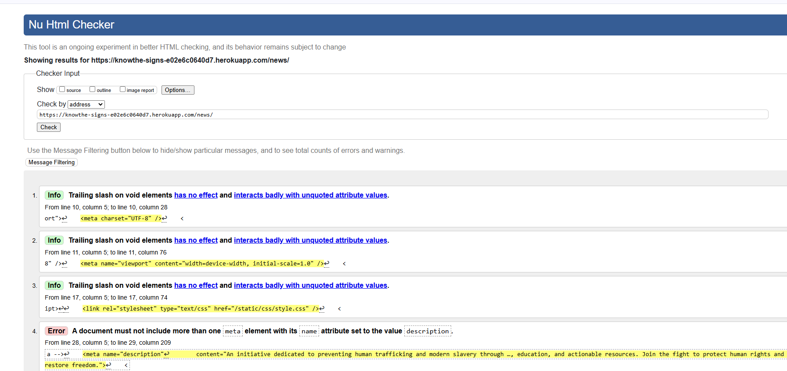
 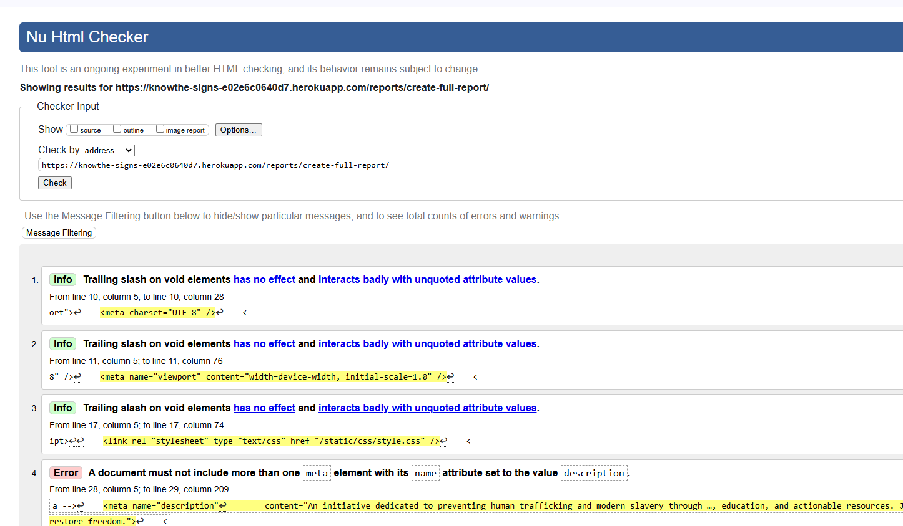

 Passed HTML validations for all the links.

* [Back to Contents](#contents)
 ## Credits

### Content References

#### Copilot

- We have utilized GitHub Copilot to assist in generating content for the website.

#### Educational sites

## Acknowledgement
 
- We would like to extend our heartfelt thanks to **Code Institute** for providing this incredible platform and the opportunity to develop "Know the signs."

- Special thanks to the instructors and mentors and Hackathon Team.

### Images

* [Right story carousel arrow](https://www.svgrepo.com/svg/334215/right-arrow)
* [Left story carousel arrow](https://www.svgrepo.com/svg/334036/left-arrow)
* [View report tick/actioned](https://www.svgrepo.com/svg/526398/unread)
* [View report pending icon](https://www.svgrepo.com/vectors/pending/)
* [View report read icon](https://www.svgrepo.com/svg/510160/read-mail)
* [View report unread icon](https://www.flaticon.com/free-icon/unread-message_7249301)
=======
- We would also like to express our gratitude to our amazing team for their hard work, dedication, and collaboration in bringing "Know the signs" to life.
* [Back to Contents](#contents)

[cssValidationImage]: ./static/img/validation/css-validation.png
